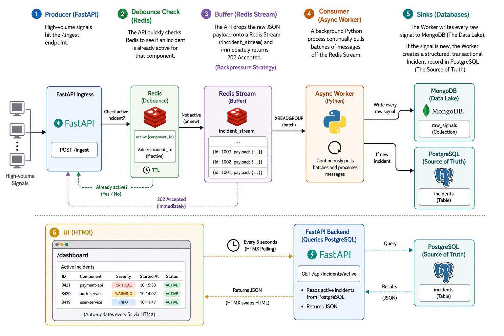

# Mission-Critical Incident Management System (IMS)

## Overview
This is a highly resilient, asynchronous Incident Management System designed to monitor a complex distributed stack. It is built to handle high-throughput error signals, manage failure mediation workflows using robust design patterns (State and Strategy), and provide a real-time, zero-reload dashboard for Site Reliability Engineers (SREs).

## Architecture


The system separates concerns into distinct layers:
1. **The Producer (FastAPI):** Ingests signals and offloads them immediately.
2. **The Buffer (Redis):** Handles debounce logic and queues raw payloads.
3. **The Consumer (Async Worker):** Processes queues in the background to prevent cascading failures.
4. **The Storage (PostgreSQL & MongoDB):** Segregates structured, transactional state data from unstructured, high-volume log data.

## Handling Backpressure
To prevent database connection exhaustion during bursts of up to 10,000 signals/sec, this system utilizes an **In-Memory Buffer Strategy**:
1. The FastAPI `/ingest` endpoint acts purely as a producer. It validates the incoming signal, performs a rapid debounce check against a Redis key, pushes the raw JSON payload onto a **Redis Stream** (`incident_stream`), and immediately returns a `202 Accepted` to the caller.
2. A background `worker.py` script asynchronously consumes this Redis stream. It handles the heavy lifting of writing unstructured data to the MongoDB Data Lake and structured, transactional data (State updates and RCA forms) to PostgreSQL. This decouples ingestion from persistence, protecting the databases from being overwhelmed.

## Setup Instructions

This project is fully containerized. Ensure you have Docker and Docker Compose installed.

1. **Start the infrastructure and services:**
   ```bash
   docker-compose up --build -d

2. **Access the Application:**

   IMS Dashboard (UI): http://localhost:8000/dashboard

   API Documentation (Swagger): http://localhost:8000/docs

3. **Simulate an Outage (Testing Backpressure):**
   Run the provided sample data script to blast concurrent signals at the ingestion API, simulating a cascading failure:

   ```bash
   chmod +x simulate_outage.sh
   ./simulate_outage.sh

4. **View Background Worker Logs:**
   To watch the async worker pull from the Redis stream, trigger alerting strategies, and save to the databases in real-time:

      ```bash
      docker logs ims_worker -f

5. **Test The RCA Workflow**      
   Look at your dashboard and grab one of the Incident IDs (e.g., INC-A1B2C3).

   Go into your code (backend/templates/rca_modal.html) and update the hx-post URL in the form to match that ID:

   HTML
   <form hx-post="/api/incident/INC-A1B2C3/close" ...>
   Save the file. (FastAPI will auto-reload).

   Fill out the RCA form on the dashboard and hit submit. You will see the green success message, and on the next 5-second tick, that incident will vanish from the "Active" table!

6. **To Close Everything
   ```bash
   docker-compose down      